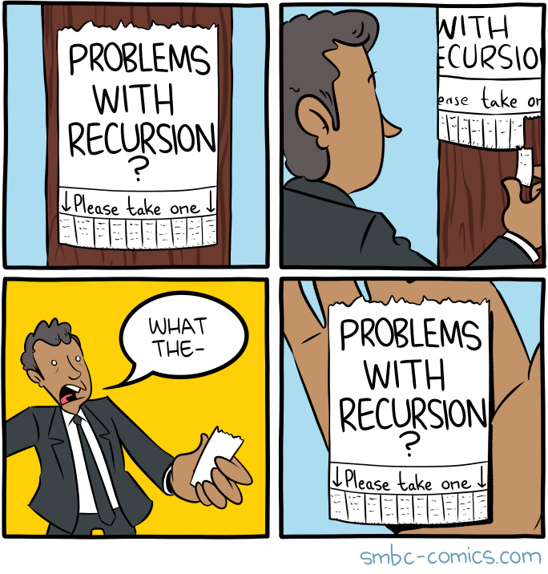

# Exercise 10.1 - 🔄 Simple Recursion

## 🎯 Objectives

- **Implement** various functions recursively in Java.

## 🔨 Setup

1. Clone the repo (or download the zip) for this exercise, which you can find [here](https://github.com/JAC-CS-Programming-4-W23/E10.1-Simple-Recursion).
2. Start IntelliJ, go to `File -> Open...`, and select the cloned/downloaded folder.
3. If at the top it says "Project JDK is not defined", click "Setup JDK" on the top right, and select the JDK version you have installed on your machine.

   

4. To get the unit tests to work, open `TestRecursion.java` and add JUnit to the classpath:

   

   - Just click "OK" on the resulting dialogue window and all the test-related red squigglies should disappear.

## 🔍 Context

In computer science, recursion is a method of solving a computational problem where the solution depends on solutions to smaller instances of the same problem. [^1]

A call to **itself** makes a function **recursive** and a **base case** is what makes it **stop**!

A recursive call without a base case will result in "infinite" recursion; a recursive function that will repeat "forever". Since we don't have infinite computing resources, we will run out of call stack space and a `StackOverflowException` will be thrown.

There is an important rule about recursive calls:

Every recursive call must **approach** the base case.

## 🚦 Let's Go

1. `int factorial(int n)`
   - Base case: The fact that $0! = 1$.
   - Strategy: For every integer $\leq n$, multiply it by the factorial of the number one less than it, all the way down to 0.

   ```text
   factorial(3) => 3 * factorial(2) => 3 * 2 * factorial(1) => 3 * 2 * 1
   ```

2. `boolean isEven(int n)`
   - Base case: If the number is zero, return true; if the number is one, return false.
   - Strategy: For a number to be even, the number minus 2 must also be even, all the way down to 0.

   ```text
   isEven(4) => isEven(2) => isEven(0) => true
   isEven(5) => isEven(3) => isEven(1) => false
   ```

3. `int sum(int[] numbers, int index)`
   - Base case: Index has gone past the end of the array, therefore sum is currently zero.
   - Strategy: Like the factorial, the sum of an array of numbers is the same as the first number plus the sum of the numbers that come after it.

   ```text
   sum([3, 2, 1]) => 3 + sum([2, 1]) => 3 + 3
   ```

4. `int max(int[] numbers, int index)`
   - Base case: Index has gone past the end of the array, therefore max is currently zero.
   - Strategy: The max of an array of numbers is the same as checking if the first number is greater than the max of the numbers that come after it.

   ```text
   max([3, 2, 1]) => 3 > max([2, 1]) => 3 > 2
   ```

5. `boolean isPalindrome(String phrase)`
   - Base case: If the length of the phrase is zero or one, return true;
   - Strategy: A phrase is a palindrome if it is spelled the same backwards and forwards (ex. "race car"). Therefore, a phrase is a palindrome if the first and last letters are the same, and if the inner phrase (second letter to second to last letter) is a palindrome.

   ```text
   isPalindrome("mom") => 'm' == 'm' && isPalindrome("o") => true
   isPalindrome("else") => 'e' == 'e' && isPalindrome("ls") => 'l' != 's' => false
   ```

6. `T[] slice(T[] elements, int start, int end)`
   - Base case: A single-element array.
   - Strategy: Divide the array into left and right sub-arrays based on the start and end values. The concatenation of the left and right sub-arrays will then be the slice of the original array.

   ```text
   slice([1, 2, 3, 4, 5], 1, 4)
      => slice([2]) + slice([3, 4])
                      slice([3, 4]) => slice([3]) + slice([4])
                      slice([3]) + slice([4]) => [3, 4]
                      [3, 4]
         slice([2]) + [3, 4] => [2, 3, 4]
   ```

## 🔬 Observations

- Taking space and time complexity into consideration, are there any advantages or disadvantages to implementing algorithms recursively over their non-recursive counterparts?

---



[^1]: https://en.wikipedia.org/wiki/Recursion_%28computer_science%29
